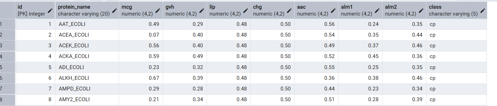
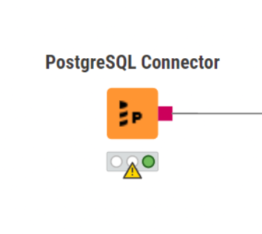
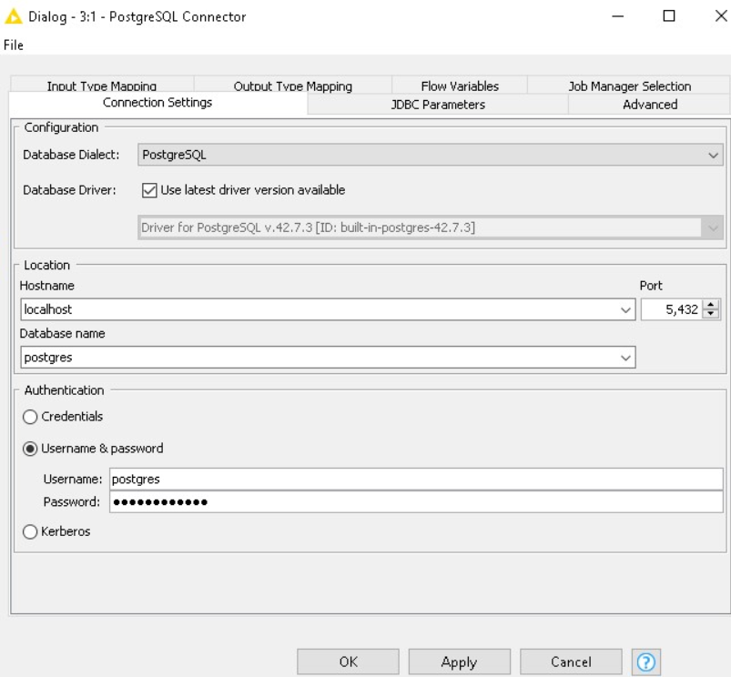
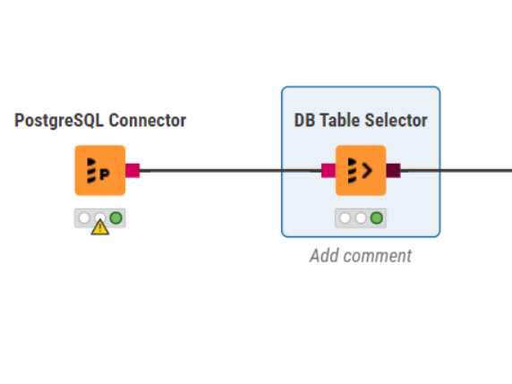

# Ereprocessing Data Ecoli menggunakan Knime

Ini adalah tahapan preprocessing data Missing Value, Outlier Detection, dan Balancing Data menggunakan aplikasi Knime Analytics. Tahapan ini dilakukan untuk mempersiapkan data sebelum masuk ke proses pemodelan. Dengan melakukan pembersihan data dari nilai yang hilang, mendeteksi outlier, serta menyeimbangkan jumlah data antar kelas, analisis yang dihasilkan akan menjadi lebih optimal dan dapat diandalkan

# Berikut data ecoli yang sudah di import ke database postgresql

Koneksi Database
Buka aplikasi Knime, kemudian cari node bernama PostgreSQL Connector, kemudian drag and drop ke bagian field di kanan. Node ini berfungsi untuk menghubungkan Knime dengan database PostgreSQL agar data dapat diakses dan diolah secara langsung. Pastikan koneksi ke server database sudah aktif sebelum melanjutkan ke tahap berikutnya.

setelah itu klik dua kali bagian node nya dan setting hostname, database, username, password dll

Memilih Table
Setelah berhasil connect ke database PostgreSQL, langkah berikutnya adalah memilih table yang akan digunakan untuk analisis. Dalam contoh kasus ini digunakan table ecoli. Tambahkan node DB Selector ke dalam workflow, kemudian sambungkan node PostgreSQL Connector ke DB Selector menggunakan kabel koneksi. Selanjutnya, pada konfigurasi DB Selector, pilih nama tabel yang diinginkan dari daftar tabel yang tersedia di database PostgreSQL. Proses ini memastikan bahwa data yang akan diproses berasal dari sumber yang tepat.

